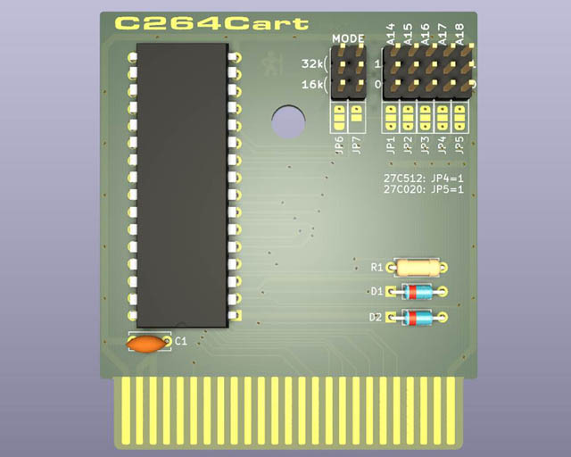
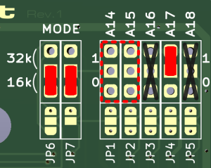
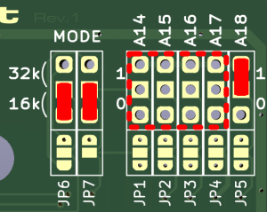
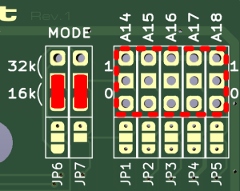
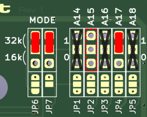
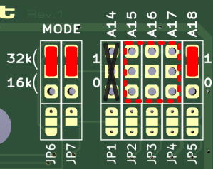

# C264Cart

The C264Cart ist a modernized ROM cartrdige for the Commodore 264 familiy of 8-bit computers, the Commodore C16, C116, and Plus/4.

I started out by first reverse engineering and replicating the layout of an original ROM cartridge. Then I adapted it to better suit EPROMS and EEPROMS still easily available today like the W27C512 and W27C020. While the layout was also reduced in size in order to save shipping costs, it still fits the original cartidge shells.

See my [blog post](https://www.hackup.net/2023/12/making-cartridges-for-the-commodore-c16-c116-and-plus-4/) for more details.

I also created a simplified version of the original cartridge shells for 3D printing that goes well with the C264Cart. It is currently available for personal use on [Thingiverse](https://www.thingiverse.com/thing:6309306) and [Printables](https://www.printables.com/model/644139-commodore-264-cartridge-case-redux-for-c16-and-plu).

## Configuration Options

There are two things that need to be configured, the type of EPROM to be used and the size of the targeted ROM images. 

The C264Cart can be configured to support either 16k ROM images or 32k ROM images by setting JP6 and JP7 accordingly. 32k ROM images for the 264 computers usually consist of two 16k parts that were originally stored in two seperate ROMs. On the C264Cart in 32k mode, both parts go into the same EPROM with the upper part directly following the lower one. As a consequence, A14 cannot **not** be used for external bank switching in 32k mode. It is selected automatically by the cartridge.

If the C264Cart is configured for 16k mode R1, D1, and D2 don't need to be populated. These components are used in 32k mode, only.

The C264Cart supports 27C512, 27C020, and 27C040 (E)EPROMs. Make sure to always align those ICs to the top of the cartridge as indicated on the silkscreen and to properly configure jumpers JP4 and JP5!

### 27C512 for 4 ROM images with 16k each

| Address   |             | A14 | A15 |
|----------:|-------------|:---:|:---:|
| 0x0000    | ROM 1       |  0  |  0  |
| 0x4000    | ROM 2       |  1  |  0  |
| 0x8000    | ROM 3       |  0  |  1  |
| 0xC000    | ROM 4       |  1  |  1  |

### 27C020 for 16 ROM images with 16k each

| Address    |             | A14 | A15 | A16 | A17 |
|-----------:|-------------|:---:|:---:|:---:|:---:|
| 0x00000    | ROM 1       |  0  |  0  |  0  |  0  |
| 0x04000    | ROM 2       |  1  |  0  |  0  |  0  |
| 0x08000    | ROM 3       |  0  |  1  |  0  |  0  |
| 0x0C000    | ROM 4       |  1  |  1  |  0  |  0  |
| 0x10000    | ROM 5       |  0  |  0  |  1  |  0  |
| ...        | ...         | ... | ... | ... | ... |
| 0x3C000    | ROM 16      |  1  |  1  |  1  |  1  |

### 27C040 for 32 ROM images with 16k each

| Address    |             | A14 | A15 | A16 | A17 | A18 |
|-----------:|-------------|:---:|:---:|:---:|:---:|:---:|
| 0x00000    | ROM 1       |  0  |  0  |  0  |  0  |  0  |
| 0x04000    | ROM 2       |  1  |  0  |  0  |  0  |  0  |
| 0x08000    | ROM 3       |  0  |  1  |  0  |  0  |  0  |
| 0x0C000    | ROM 4       |  1  |  1  |  0  |  0  |  0  |
| 0x10000    | ROM 5       |  0  |  0  |  1  |  0  |  0  |
| ...        | ...         | ... | ... | ... | ... | ... |
| 0x7C000    | ROM 32      |  1  |  1  |  1  |  1  |  1  |

### 27C512 for 2 ROM images with 32k each
A14 must be left open!

| Address   |             | A14 | A15 |
|----------:|-------------|:---:|:---:|
| 0x0000    | ROM 1 low   |  x  |  0  |
| 0x4000    | ROM 1 high  |  x  |     |
| 0x8000    | ROM 2 low   |  x  |  1  |
| 0xC000    | ROM 2 high  |  x  |     |

### 27C020 for 8 ROM images with 32k each
A14 must be left open!

| Address    |             | A14 | A15 | A16 | A17 |
|-----------:|-------------|:---:|:---:|:---:|:---:|
| 0x00000    | ROM 1 low   |  x  |  0  |  0  |  0  |
| 0x04000    | ROM 1 high  |  x  |     |     |     |
| 0x08000    | ROM 2 low   |  x  |  1  |  0  |  0  |
| 0x0C000    | ROM 2 high  |  x  |     |     |     |
| ...        | ...         |  x  | ... | ... | ... |
| 0x38000    | ROM 8 low   |  x  |  1  |  1  |  1  |
| 0x3C000    | ROM 8 high  |  x  |     |     |     |

### 27C040 for 16 ROM images with 32k each
A14 must be left open!

| Address    |             | A14 | A15 | A16 | A17 | A18 |
|-----------:|-------------|:---:|:---:|:---:|:---:|:---:|
| 0x00000    | ROM 1 low   |  x  |  0  |  0  |  0  |  0  |
| 0x04000    | ROM 1 high  |  x  |     |     |     |     |
| 0x08000    | ROM 2 low   |  x  |  1  |  0  |  0  |  0  |
| 0x0C000    | ROM 2 high  |  x  |     |     |     |     |
| ...        | ...         |  x  | ... | ... | ... | ... |
| 0x78000    | ROM 16 low  |  x  |  1  |  1  |  1  |  1  |
| 0x7C000    | ROM 16 high |  x  |     |     |     |     |

### Caption

## License

 **USE AT YOUR OWN RISK!**.

This work is licensed under a
[Creative Commons Attribution-NonCommercial-ShareAlike 4.0 International License](http://creativecommons.org/licenses/by-nc-sa/4.0/).
